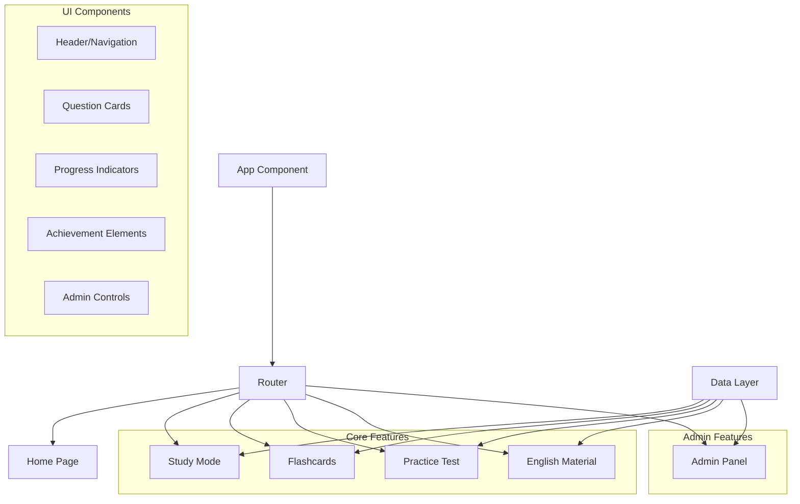
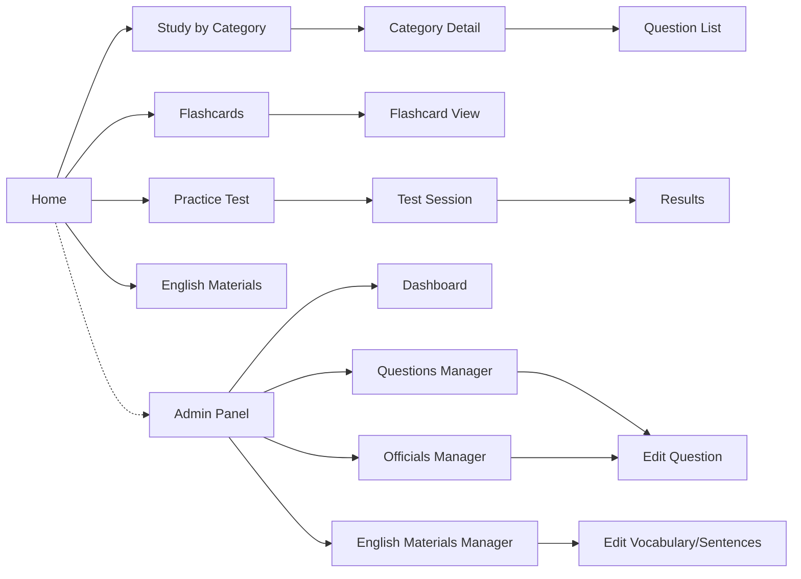
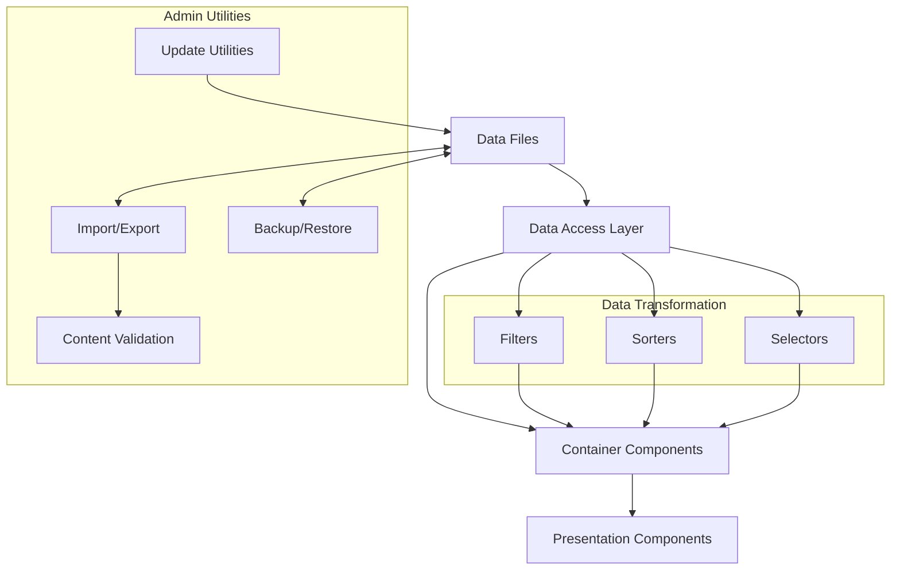

# System Patterns: BecomeUSCitizen App

## Architecture Overview

The BecomeUSCitizen app follows a component-based architecture using React, with a focus on maintainability, simplicity, and ease of content updates.

## Key Design Patterns

### Component Hierarchy

1. **App Shell Pattern**
   - A consistent outer shell (header, navigation, footer)
   - Content area that changes based on selected route
   - Maintains visual consistency across the application

2. **Page-Component Pattern**
   - Each route corresponds to a page component
   - Pages compose smaller, reusable components
   - Clear separation between page layout and functional components

3. **Container-Presentation Pattern**
   - Container components manage state and data fetching
   - Presentation components focus on rendering UI
   - Enhances reusability and testability

4. **Responsive Design Pattern**
   - Mobile-first approach with media queries
   - Hamburger menu for mobile navigation
   - Fixed header that stays at the top when scrolling
   - Flexible layouts that adapt to different screen sizes
   - Consistent spacing and typography across devices
   - Space-efficient UI elements for small screens:
     - Icon-based badges instead of text labels
     - Dropdowns instead of horizontal button groups
     - Merged UI elements to reduce vertical space
     - Proper text wrapping for long content

5. **Dropdown Navigation Pattern**
   - Hierarchical navigation with dropdown menus for related items
   - Grouping of related navigation items (Study, Flashcards, Practice Test, English Study)
   - Accessible implementation with proper ARIA attributes
   - Smooth transitions and animations for dropdown visibility
   - Consistent behavior across desktop and mobile views

6. **Animation System Pattern**
   - Centralized animation definitions in animations.css
   - Component-specific animation implementations
   - Reusable animation components (PageTransition, ScrollReveal)
   - Performance-optimized animations using CSS transitions and transforms
   - Intersection Observer for scroll-triggered animations

### State Management

1. **React Hooks Pattern**
   - Use of useState for component-level state
   - Use of useEffect for side effects and lifecycle management
   - Use of useContext for sharing state across components when needed

2. **Prop Drilling Minimization**
   - Thoughtful component composition to minimize prop drilling
   - Strategic use of context for widely needed state
   - Clear data flow from parent to child components

3. **Immutable State Updates**
   - All state updates follow immutability principles
   - Use of spread operators and array methods for state updates
   - Predictable state transitions

### Data Management

1. **Static Data Pattern**
   - Questions and answers stored as static JavaScript objects/arrays
   - Organized by categories and attributes
   - Clear separation of static and dynamic content
   - Enhanced content with explanations and memory devices

2. **Data Transformation Layer**
   - Utility functions to filter, sort, and transform data
   - Separation of data structure from presentation
   - Reusable data operations across components

3. **Content Update Strategy**
   - Isolation of frequently changing content (e.g., officials' names)
   - Version tracking for content updates
   - Clear update paths for content maintenance

## Component Relationships

### Navigation Flow

### Data Flow

## Critical Implementation Paths

### Study Mode Implementation

1. Create data structure with categories
2. Implement category listing component
3. Develop question listing by category
4. Add filtering capabilities
5. Implement enhanced content with explanations and memory devices
6. Add content display preferences with toggle switches
7. Implement progress visualization for tracking viewed questions
8. Use localStorage for persisting user progress between sessions

### Flashcard Implementation

1. Create card component with flip animation
2. Implement navigation between cards
3. Connect to data source with filtering

### Practice Test Implementation

1. Create test generator utility
2. Implement question display component
3. Develop scoring mechanism
4. Create results display

### Content Update Mechanism

1. Isolate changeable content
2. Implement version tracking
3. Create clear update process

### Admin Panel Implementation

1. **Authentication Pattern**
   - Simple password-based authentication for admin access
   - Protected route that's not accessible from main navigation
   - Clear separation between user and admin interfaces

2. **Dashboard Pattern**
   - Overview of content statistics and metrics
   - Quick access to frequently used admin functions
   - Visual representation of content organization

3. **Content Management Pattern**
   - CRUD operations for questions and content
   - Filtering and search capabilities for efficient content management
   - Form-based editing with validation
   - Preview of how content will appear to users

4. **Data Import/Export Pattern**
   - JSON-based export for backup and external editing
   - Import validation to ensure data integrity
   - Backup creation before making significant changes

## Technical Debt Considerations

To maintain a clean codebase and facilitate future enhancements:

1. **Avoid Premature Optimization**
   - Focus on clear, readable code over performance optimizations
   - The data set is small enough that complex optimization is unnecessary

2. **Maintain Component Boundaries**
   - Clear interfaces between components
   - Avoid tight coupling between unrelated components

3. **Document Edge Cases**
   - Note special cases in content (e.g., questions with multiple answers)
   - Document content update procedures

4. **Prepare for Future Enhancements**
   - Design components to accommodate potential future features
   - Use clear naming conventions that allow for expansion
